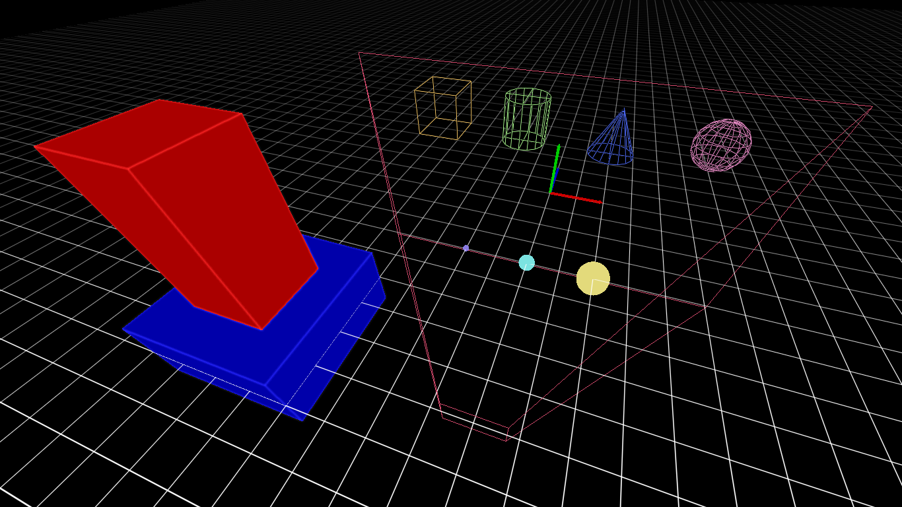

# IMDD
This is my simple Immediate Mode Debug Draw implemented in Odin and OpenGL

## Example
You can take this [template](https://github.com/deltasampler/odin_sdl3_template) and replace `main.odin` with `main.odin` from **example** directory
## Primitives:

    // point
    debug_point :: proc(position: glm.vec3, radius: f32, color: i32)

    // arrow
    debug_arrow :: proc(start: glm.vec3, end: glm.vec3, width: f32, color: i32)

    // grid from position and normal
    debug_grid_plane_n :: proc(position: glm.vec3, size: glm.vec2, normal: glm.vec3, cell_size: glm.vec2, line_width: f32, color: i32)

    // grid on xz plane
    debug_grid_plane_xz :: proc(position: glm.vec3, size: glm.vec2, cell_size: glm.vec2, line_width: f32, color: i32)

    // axis aligned bounding box
    debug_aabb :: proc(position: glm.vec3, size: glm.vec3, color: i32)

    // axis aligned bound box (from min/max bounds)
    debug_aabb_bounds :: proc(min: glm.vec3, max: glm.vec3, color: i32)

    // oriented bounding box
    debug_obb :: proc(position: glm.vec3, size: glm.vec3, rotation: glm.vec3, color: i32)

    // cylinder (axis aligned)
    debug_cylinder_aa :: proc(position: glm.vec3, size: glm.vec2, color: i32) 

    // cylinder (oriented)
    debug_cylinder_o :: proc(position: glm.vec3, size: glm.vec2, rotation: glm.vec3, color: i32)

    // cylinder (from point A to point B)
    debug_cylinder_ab :: proc(start: glm.vec3, end: glm.vec3, radius: f32, color: i32)

    // cone (axis aligned)
    debug_cone_aa :: proc(position: glm.vec3, size: glm.vec2, color: i32)

    // cone (oriented)
    debug_cone_o :: proc(position: glm.vec3, size: glm.vec2, rotation: glm.vec3, color: i32)

    // cone (from point A to point B)
    debug_cone_ab :: proc(start: glm.vec3, end: glm.vec3, radius: f32, color: i32)

    // sphere
    debug_sphere :: proc(position: glm.vec3, radius: f32, color: i32)

    // frustum
    debug_frustum :: proc(proj_view: glm.mat4, color: i32)
